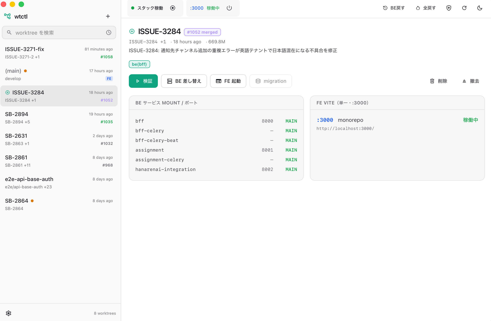
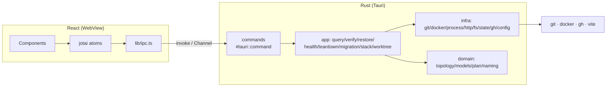

# wtctl-app

**wasurenai の git worktree を、メインチェックアウトを一切動かさずに Docker スタックへ差し替えて動作確認する**デスクトップアプリ。[wtctl](../wtctl)（ターミナル TUI）の GUI 版で、リアルタイムなログ表示・GUI 上の設定・ChatGPT ライクな操作感を提供する。

Tauri v2（Rust バックエンド）+ React + TypeScript + Tailwind で構築。git / docker / gh を Rust から直接叩くため、Python ランタイム不要の単一バイナリで動く。

---

## これは何をするツールか

複数の worktree で並行開発しているとき、ある worktree のコードを「メインに checkout し直す」ことなく、稼働中の `docker compose` スタックの `/app` bind mount をその worktree に一時的に差し替えて動作確認する。FE は常に単一ポート `:3000` で Vite を起動する（並行起動しない）。確認後はワンクリックでメインへ戻せる。

- **BE**: 稼働中スタックの bind mount を worktree に差し替え（コンテナ recreate 約 10 秒、autoreload 有効）
- **FE**: worktree の Vite を `:3000` で起動（既存の `:3000` は自動停止）
- **メインチェックアウト・DB・未コミット変更は無傷**
- **migration** の適用と巻き戻しに対応

---

## スクリーンショット

<!-- docs/dashboard.png などに配置 -->
<p align="center"></p>

---

## 主な機能

- **ダッシュボード**: worktree 一覧（最新コミット・ahead・dirty・リモート同期・PR 状態・ディスク使用量）、BE サービスの mount 先とポート、FE `:3000` の占有状況を一覧
- **リアルタイムログ**: verify / BE 差し替え / FE 起動 / restore / migration の実行出力を下部ドロワーにストリーム表示（ANSI 除去・意味づけ配色・ワンクリックコピー）
- **worktree ライフサイクル**: ブランチ指定での作成（PR / WT 状態付きピッカー）、削除、撤去（メインで該当ブランチへ checkout）
- **スタック操作**: 起動 / 停止（stop のみ・DB は down しない）、health（自動復旧）
- **GUI 設定**: リポジトリ・worktree 作成先をフォルダピッカーで設定
- **並列収集**: worktree ごとの plan / meta を上限 8 の並列で収集（worktree が多くても高速）

---

## アーキテクチャ

Rust 側はクリーンアーキテクチャ（domain ← application ← infrastructure）。フロントは IPC 型ラッパ + jotai で状態管理する。



- 読み取り系コマンドはデータを返す。アクション系は `Channel<LogEvent>` で実行ログを 1 行ずつフロントへ流す。
- git / docker / gh はブロッキングなので `spawn_blocking` でワーカースレッドに逃がし、UI を固まらせない。
- 現在の mount 状態の真実源は `docker inspect`。`swaps.json` は差し替えの意図の記録に留める。

---

## セットアップ

### 前提

- macOS（`titleBarStyle: Overlay` 前提。他 OS でも動くが未検証）
- Rust ツールチェーン、Node.js 20+
- `git` / `docker` / （任意）`gh`

### 開発起動

```bash
npm install
npm run tauri:dev
```

### ビルド（配布用 `.app` / `.dmg`）

```bash
npm run tauri:build
```

---

## 設定

設定は XDG 準拠の場所に置く（各自ローカル専用）。

- 設定: `$XDG_CONFIG_HOME/wtctl/config.json`（既定 `~/.config/wtctl/config.json`）
- 状態: `$XDG_STATE_HOME/wtctl`（既定 `~/.local/state/wtctl`）

初回起動時にリポジトリ未設定なら設定画面が出る。GUI から設定できるほか、手動でも書ける（[`config.example.json`](config.example.json) 参照）。

```json
{
  "repo": "/absolute/path/to/wasurenai",
  "worktree_dir": ".claude/worktrees"
}
```

- `repo`（必須）: wasurenai リポジトリの絶対パス（`compose.yaml` と `backend/bff` の存在で検証）
- `worktree_dir`（任意）: worktree 作成先。相対パスは repo 起点。既定は `<repo>/.claude/worktrees`

> 設定・状態は TUI 版 `wtctl` と同じ場所を共有する。どちらから操作しても差し替え状態は一貫する。

---

## TUI 版 `wtctl` との関係

- ロジック（プラン検出・mount 差し替え・restore・migration・teardown）は同一のセマンティクスを Rust で再実装している。TUI のコードには依存しない。
- 設定・状態ファイルは共有するため、TUI とアプリを混在させても整合する。
- アプリは「リアルタイムログ」「GUI 設定」「洗練された一覧」を提供する。ターミナルで完結したいときは TUI を使う。
